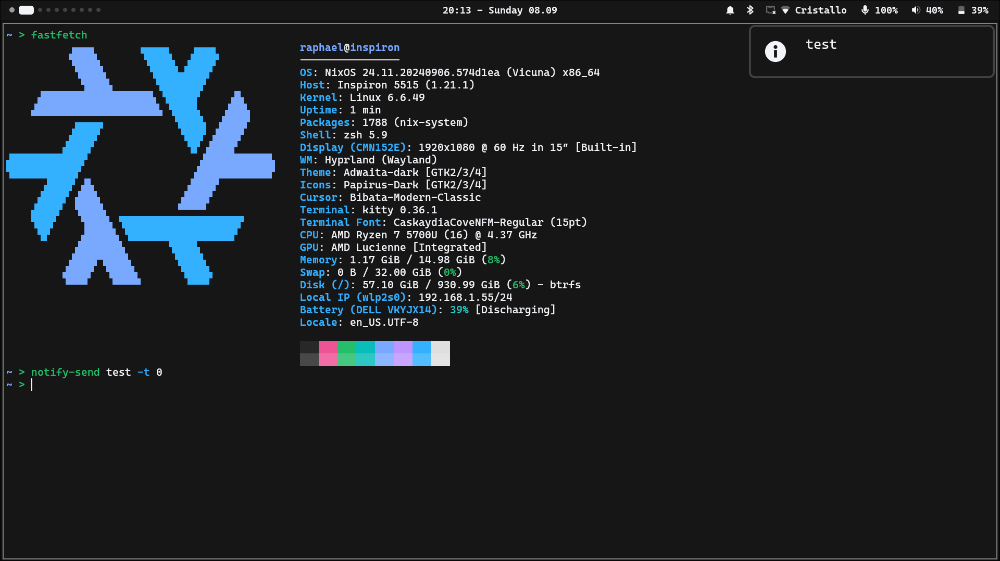

    <h1>
      
    </h1>
    
This flake contains my NixOS configuration files.

## Hosts

- [`inspiron`](./hosts/inspiron/README.md)

## Users

- [`raphael`](./hosts/common/users/raphael/README.md)
- [`root`](./hosts/common/users/root/README.md)

## Screenshots

### Hyprland (inspiron, raphael)

## Resources

- [Nixos Packages Search](https://search.nixos.org/packages)
- [Nixos Options Search](https://search.nixos.org/options)
- [Home Manager Options](https://home-manager-options.extranix.com)
