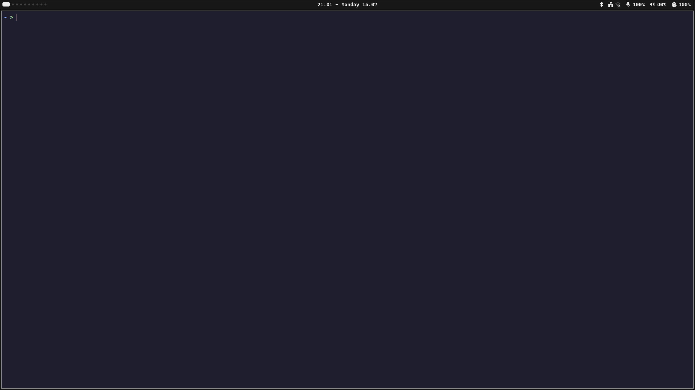

    <h1>
      
    </h1>
    
This repository contains my NixOS configuration files.

## Hosts

- `inspiron`: Dell Inspiron 15 5515 | Laptop Workstation | Hyprland

## Users

- `raphael`: main user
- `root`: root user

## Screenshots

### Hyprland

